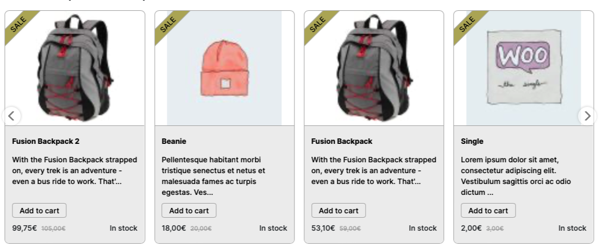

## Hvorfor?

Det primære produkt, som [Hello Retail](https://helloretail.com) sælger, er anbefalingsbokse. Det var nok noget af det, som jeg ville komme til at arbejde meget med, så derfor var det vigtigt at jeg blev sat ordentligt ind i dem. Der blev sat et sandkassemiljø op til mig, hvor jeg kunne udforske anbefalingsboksene så meget jeg lystede. I dette miljø var der ingen risiko for at ødelægge noget på eksisterende kunders anbefalingsbokse.

## Process

Alle anbefalingsbokse skulle sættes op i Hello Retails interne *Supervisor*-system, eller i deres nyere *Company Land*. Alle nye onboardings skulle sættes op det nyere system, men der der dog stadig mange kunder, der bruger det gamle system.

### Placement-selector

Først skulle jeg vælge hvorhenne på hjemmesiden min anbefalingsboks skulle indsættes. Til det skal man bruge en placement-selector. Det kunne blandt andet være en `
` med et unikt id. Som standard bliver der sat div-elementer ind på hjemmesiden som vi kan bruge, for eksempel `

`.

### Design

Når anbefalingsboksen er placeret, kan man starte med at ændre i dens design. Designet er bygget op som en [liquid template](https://shopify.github.io/liquid/) med slider-funktionalitet  fra [swiper.js](https://swiperjs.com).

Normalt ville man prøve at få anbefalingsboksen til at ligne de oprindelige anbefalingsbokse på kundens side. Dette bliver gjort ved at genbruge se CSS-klasser, som kunden også bruger til deres egne. 

Jeg sad og ændrede i designet i sandkassemiljøet, og endte med en anbefalingsboks der så således ud:

### Anbefalingsstrategi

Der skal sættes en anbefalingsstrategi til enhver anbefalingsboks. Den bestemmer, hvilke produkter som anbefalingsboksen får lov til at vise. Strategien besår af *X* antal trin, hvorfra den for hvert trin finder det antal af produkter, som opfylder trinnets krav.

Man kan også sætte både lokale og globale filtre på sin anbefalingsstrategi. For eksempel, hvis man ikke vil vise udsolgte produkter, kan man sætte et globalt filter med `product.inStock === true`. Man kan ligeledes sætte lokale filtre på hvert trin.

For hvert trin kan man vælge forskellige typer af strategier. Her er et udsnit af mulige typer:
- Top Produkter
- Alternative Produkter
- Relaterede Produkter
- Retargeted Produkter
- Produkter Købt Sammen
- Købt for nyligt

Hvis et trin ikke giver nogle produkter, går systemet videre til næste trin. Hvis den ikke kan fylde hele anbefalingsboksen op, så bliver boksen ikke vist på hjemmesiden.

## Afrunding

Det var spændende at få et kig på, hvordan der bliver arbejdet med anbefalingsbokse på et professionelt niveau. Alle elementerne var meget splittet op, så det var soleklart hvad man arbejder på, uden den struktur ville det være meget uoverskueligt.

At der blev brugt et javascriptbibiolotek til slider-funktionaliteten, i stedet for en "in-house" løsning var også interessant. Man kunne altid prøve at lave sin egen løsning, men hvis der allerede er en "out-of-the-box" løsning der virker, kan det være spildt arbejde og i sidste ende kræve flere ressourcer.