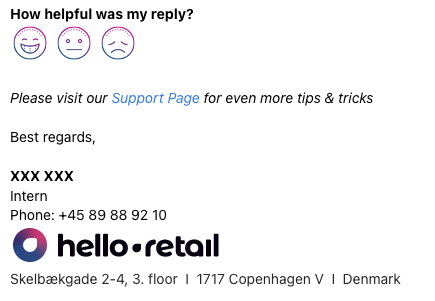

## Hvorfor?

Det havde hele tiden været en del af praktikplanen at jeg selv, som praktikant hos [Hello Retail](https://helloretail.com), skulle være i kontakt med de kunder, som jeg fik tildelt. Før dette rigtig kunne lade sig gøre, var det vigtigt at jeg fik en introduktion til, hvordan man skulle tale med Hello Retails kunder. Denne introduktion var tilrettelagt af min afdelingschef, og var ganske kort og enkel

Til introduktionen blev der blandt andet forklaret, at når vi kommunikerer med andre mennesker, er måden som andre opfatter og forstår vores kommunikation primært fordelt blandt disse 3 faktorer:

- 55% Kropssprog
- 38% Tone
- 7% Ord

Det betyder, at det er sværere at kommunikere via e-mail, end hvis man tager ud til kunden og taler med dem. Dog kan vi ikke at praktiske årsager besøge hver kunde når der opstår problemer, så vi må holde os til e-mail/telefon. Derfor skal vi vende os til kun at bruge de 8%, som vi har tilgængelige i e-mailformat.

## Kundesamtalen

Disse samtaler skal holde en speciel struktur, for at være mest mulig effektiv. Denne struktur er således:

- Velkomst & Indledning
- Beskrivelse af Problem
- Opsummering/Problemløsning
- Afslutning

Udover en fast struktur blev jeg også fortalt, at det var meget vigtigt, at det var mig og ikke kunden, som skulle styre samtalen. Dette sikre at samtalen altid forbliver relevant og meningsfuld.

## Ekstra opsætning

For at fremstå mere professionel skulle jeg også have opsat en signatur i vores e-mailsystem [Front](https://front.com). Her er den anonymiserede udgave:

## Afrunding

At tale med kunder er en vigtig del af praktikken, og en vigtig færdighed generelt. Før introduktionen havde jeg kun erfaring med fysisk kundekontakt fra tidligere arbejdspladser. Denne introduktion har åbnet mine øjne for, hvor svært det kan være at skabe en god og professionel kommunikation med en kunde, når man ikke kan bruge alle ens kommunikative værktøjer.