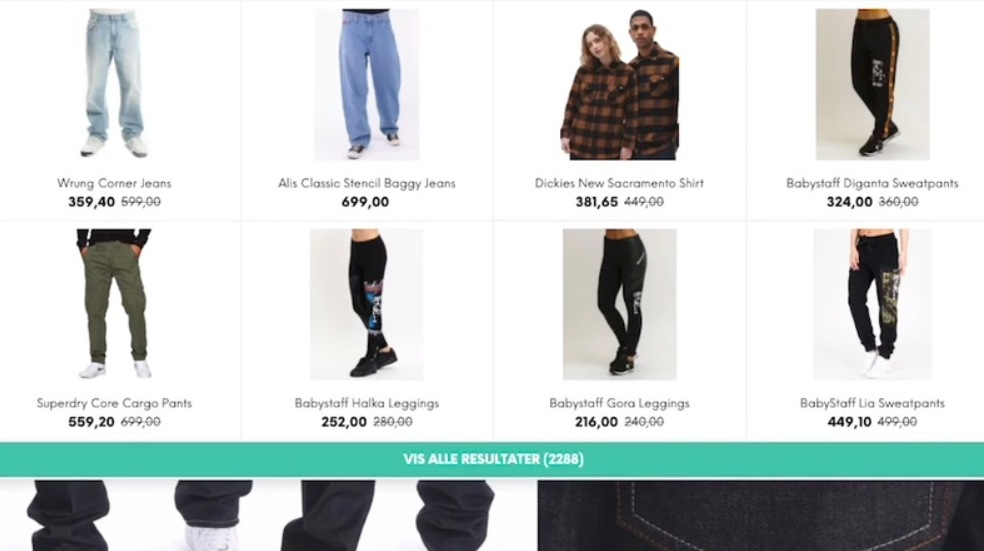

## Hvorfor?

Et af de produkter, som [Hello Retail](https://helloretail.com) sælger, er en søgefunktion. Kunden kan købe denne løsning, og så erstattes deres egen søgefunktion med vores. Eftersom en del kunder ender med også at skulle have denne funktion, fik jeg også en introduktion til denne løsning. Der blev, ligesom med [min introduktion til anbefalingsbokse](/introduktion-til-anbefalingsbokse), opsat et sandkassemiljø, hvor jeg kunne udforske [Overlay Search](#søgefunktionstyper)-søgefunktionen så meget jeg lystede. I dette miljø var der ingen  risiko for at ødelægge noget på eksisterende kunders søgning.

## Process

Alle søgefunktioner skulle sættes op i Hello Retails interne *Supervisor*-system.

### Søgefunktionstyper

Der er et par forskellige søgefunktionstyper at vælge imellem, når en søgefunktion skal sættes op. Her er, hvordan hver især kunne være implementeret hos en af Hello Retails kunder:

- **Instant Search**

    Instant Search fungerer ved, at der bliver vist et lille udsnit af produkter, når kunden søger. Det er ikke muligt at sortere eller filtrere, men hvis man går ind for at se alle produkter *(enten ved at klikke eller ved at trykke på `enter`-tasten)* på en Instant Search Page, er disse funktionaliteter tilgængelige. Denne løsning kræver, at kunden giver os en side uden content, så vi kan indsætte vores søgning og søgeresultater. Der er 2 forskellige slags Instant Search:

    - List Instant Search

        Her er en liste med produkter tilgængelig, når brugeren er i gang med en søgning:
        
        

    - Grid Instant Search

        Her er et gitter med produkter tilgængelig, når brugeren er i gang med en søgning:
        
        

Når man får navigeret sig ind på en Instant Search Page, kan det se således ud:

- **Overlay Search**

    Til Overlay Search er der 2 forskellige templates. Et til mobilvisning og et til laptopvisning. Det er vigtigt at de begge bliver sat op. Der er en gammel/klassisk version af denne søgning, som ikke viser noget indledende indhold til søgningen, men her er et eksempel på, hvordan det nye Overlay Search er implementeret på mobil og laptop med indledende indhold *(populære produkter)*:

    
        
    

    - Embeded Overlay Search

        I denne version af Overlay Search er kundens egen hjemmeside-header synlig, imens at vores søgefunktion er åben. Det kræver, at kunden har et søge-inputfelt i deres egen hjemmeside-header. Denne type søgefunktionstype virker kun på laptop, så der skal også implementeres en Overlay Search til mobilen. Her ses en Embeded Overlay Search:

        

- **Full Search**

    Her skal der, ligesom i Instant Search, være en side uden andet indhold end en header og en footer, hvor vi kan indsætte vores søgning og søgeresultater. Denne søgning bliver dog primært ikke brugt mere. Der er 3 forskellige typer af Full Search.

    - Paged *(Pagineret søgning)*

    - Infinite *(Skal kun bruges hvis kunden specifikt beder om det)*

    - Responsive *(Ny og mere mobilvenlig version af Infinite)*

### Design

Når typen er valgt, kan man starte med at ændre i dens design. Designet er bygget op som en [liquid template](https://shopify.github.io/liquid/). I designet er det vigtigste at huske, at produktfliserne bliver genereret 2 gange. Én gang for det indledende indhold, og én gang for søgeresultaterne. Hvis man kun opdatere layoutet ét af stederne, har man to forskellige produktfliser i søgningen.

Jeg sad og ændrede i designet på en Overlay Search i sandkassemiljøet, og endte med dette søgefunktionsdesign *(laptopdesignet er beige, mobildesignet er pink)*:

## Afrunding

Søgefunktionen er en meget stor opgave med mange små ting, som man skal være sikker på at huske. Det kræver et godt overblik at arbejde med søgefunktionen, og da der ikke er nogen versionsstyring, skal man være sikker på at alt er, som det skal være.

Der er mange forskellige søgningstyper, og at finde hoved og hale i det hele kommer til at tage lidt tid. Men eftersom kunderne kan have forskellige ønsker til søgningen, giver det god mening.

Alt produktflisen skal ændres to steder, i stedet for at have en template for dig, er lidt spøjst. Men hvis man løber ind i problemer med det, er det nemt at huske, at man skal huske at kopiere løsningen til den ene flise over til den anden.