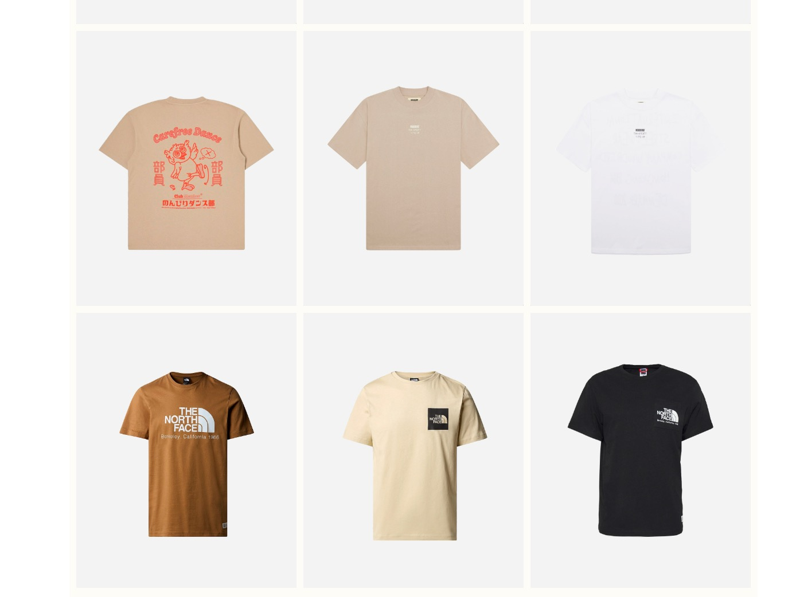
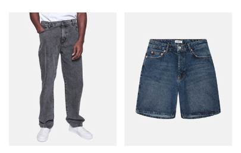

## Opgaven

Denne kunde skulle have flere nye produktfliser til deres nyhedsbrev. Disse fliser skulle have et lidt alternativt design; nemlig uden hverken produkttitel eller produktpris. Produktflisen skulle altså, i sig selv, bare være et billede af produktet. Jeg fik et referencebillede, som jeg kunne gå ud fra:



## Process

De ville gerne have 2 forskellige nye designs. Ét design med 4 rækker og 4 koloner, og ét design med 3 rækker og 4 koloner. Begge designs skulle være kompatible med [Klaviyo](https://klaviyo.com). Antallet af rækker bliver sat af kundens selv, når de vælger hvor mange produkter, som skal være med i nyhedsbrevet. Det betød, at jeg bare skulle lave ét design, hvor der var 4 koloner af produktfliser. 

Et nyhedsbrev er 600px i bredden. Det betød, at hver produktflise skulle have en maksimal bredde på `600px / 4 = 150px`. For at tilføje lidt mellemrum mellem fliserne, endte jeg med at lave produktfliserne 145px brede.

Meget af selve kodningen af produktflisen var at fjerne standardopsætningen af produktflisen, som automatisk bliver genereret, når man opretter et nyt design. Du kan se et udsnit af koden her:

```html
<html>
	<head>
		<style>
			#container {
				width: 145px;
				height: 180px;
				background-color: #F3F3F3;
			}
			.productImageContainer {
				position:relative;
				height: 180px;
				width:auto;
			}
			.productImage{
				background-image: url("{{product.imgUrl}}");
				background-size: contain;
				position: absolute;
				background-position: center;
				background-repeat: no-repeat;
				height: 100%;
				width: 100%;
			}
		</style>
	</head>
	<body>
		<div id='container'>
			<div id='inner'>
				<div class='productImageContainer'>
					<div class='productImage'></div>
				</div>
			</div>
		</div>
	</body>
</html>
```

## Resultat

Det færdige resultat er meget lig det referencebillede, som jeg fik tildelt i starten af implementeringsprocessen. Du kan se et udsnit af de færdige produktfliser her:

