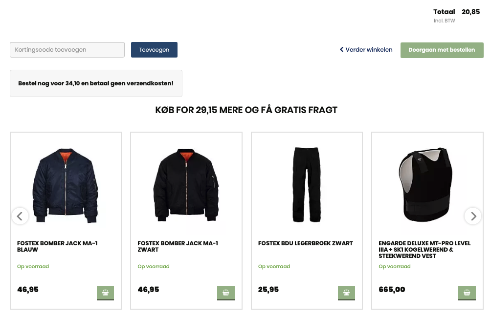
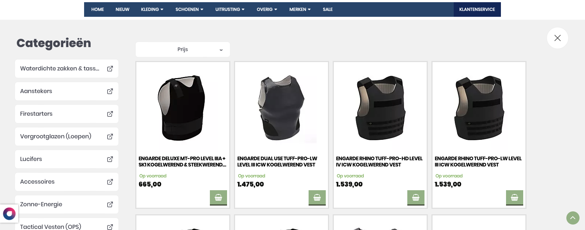

## Opgaven

Denne nye hollandske kunde skulle både have vores søgefunktion, vores anbefalingsbokse, nyhedsbrev og opsætning af vores Audience løsning *(kundestatistik)*. Det var den mest omfattende onboarding jeg havde lavet indtil da, men den var heldigvis stadig kun på ét domæne.

## Process

### Audience

For at kunne opsætte vores Audience løsning for kunden, skulle jeg have adgang til et ordrerfeed, som kunne få mere end et år tilbage. Når det var sat op, kunne tracking af kunder på hjemmesiden startes ved hjælp af et tilladelsesfeed, som vi også skulle have fra kunden. Opsætningen og det efterfølgende sammenspil af disse to feeds var nok til at opsætte vores Audience-løsning for kunden.

### Nyhedsbrev

Produktflisen i nyhedsbrevet skulle ligne kundens egen produktflise. Dog var der visse ting, som ikke kunne komme med på flisen. Da vores e-mails ikke kunne indeholde ikoner fra bl.a. [Font Awesome](https://fontawesome.com), var det ikke muligt at tilføje indkøbskurv-ikonet til den grønne købs-knap. Derfor blev knappen fjernet helt fra layoutet. Her kan du se et udsnit af koden til den færdige produktflise:

```html
<html>
	<head>
		<style>
			#inner {
				[...]
				position: relative;
			}
			span.previous {
				text-decoration: line-through;
				font-weight: normal;
				color: #0b0d09;
				font-size: 12px;
				margin-right: 40px
			}
			p.stock{
				color: #77ae45;
				font-weight: 700;
				font-size: 12px;
				padding-top: 10px;
				padding-bottom: 5px;
			}
			div.salebadge{
				background-color: #dd1719;
				color: white;
				padding: 5px 15px;
				text-transform: uppercase;
				position: absolute;
				top: 5px;
				right: 25px;
				font-weight: 600;
				font-size: 18px;
			}
		</style>
	</head>
	<body>
		<div id="container">
			<div id="inner">
				
					<div class="salebadge">Sale</div>
				
				
				<div class="title-container">
					<h2 class="title">{{ product.title | slice: 0, 35 }}</h2>
				</div>
				
					<p class="stock">Op voorraad </p>
				
				<div class="price-container">
					
						<span class="price previous">{{ product.oldPrice | price }}</span>
						<span class="price offer">{{ product.price | price }}</span>
					
						<span class="price">{{ product.price | price }}</span>
					
				</div>
			</div>
		</div>
	</body>
</html>
```

Og her kan du se, hvordan produktflisen til nyhedsbrevet endte med at se ud. Første billede er af kundens egne produktfliser på en kategoriside, og andet billede er af de færdige produktfliser til nyhedsbrevet:


	
	


Kunden skulle også have opsat e-mail triggers. Disse triggers skulle ikke opsættes efter allerede implementeret løsning, så jeg skulle arbejde udfra vores standard e-email template. Jeg var ikke meget, som skulle ændres dog. Jeg indsatte kundens logo i e-mailens header, og skrev lidt information om kunden i e-mailens footer:

```html
<b>[...]</b> 
<a href="[...]">[...]</a> | <a href="mailto:[...]">[...]</a> | <a href="tel:[...]">Tel: [...]</a>
```

### Anbefalingsbokse

Jeg startede med selv at sætte placement-selectors ind til samtlige anbefalingsbokse. Efter at have gjort dette, og sikret mig, at anbefalingsboksene var opsat på de korrekte sider, kunne jeg sende opgaven til en af vores fastansatte udviklere.

For at de kunne tilføje samme funktionalitet til anbefalingsboksene og søgefunktionen, som oprindeligt var på siden, skulle jeg ind og tilføje et `productId` i produktfeedet. Det gjorde jeg således:

```js
function transform(item): TransformationResult {
	return {
		[...]	
		extraData: {
			[...]
			id: product.id,
		}
	};
}
```

Jeg skulle også opsætte anbefalingsboksen på kurvesiden, så den dynamisk kunne vise, hvor langt kunden var fra at kunne få gratis fragt på deres ordre. For at kunne gøre dette, skulle jeg crawle ordrens pris *(og URL'er, så vi ikke vidste de samme produkter, som kunden allerede havde lagt i sin kurv)*:

```js
urls: $(".cart-container .cart-item .title-prod-cart a").fns("prop", "href")
price: $("#cart-totals td[data-th='Totaal'] .price").fns("text").pop()

```

Da jeg havde sat dette op virkede selve prisen, og kunne fortælle hvor langt kunden var fra gratis fragt. Dog opstod et andet problem; teksten, som skulle forklare gratis-fragt princippet, var ikke på hollandsk. Ydermere var det ikke de rigtige pile, som anbefalingsboksen brugte til at scrolle produkter:



Heldigvis kunne jeg relativt nemt ændre teksten i anbefalingsboksen kode, og derefter var det kun pilene, som skulle ligne kundens egne pile.

```js
header.textContent = `KOOP VOOR ${freeShippingAmount} MEER EN KRIJG GRATIS VERZENDING`;
```

### Søgefunktionen

Her kan du se hvordan Overlay Embeded søgningen så ud, inden jeg implementerede de manglende filtre, som jeg først fik adgang til fra produktfeedet senere:



For at kunne filtrere produkterne skulle jeg nemlig ind og ændre lidt i produktfeedet. Jeg tilføjede `&extraAttributes=manufacturer,maat,kleur` til produktfeedets url, hvilket gjorde jeg kunne fange data som f.eks.:

```js
function transform(item): TransformationResult {
	return {
		[...]
		extraDataList:{
			sizes: product?.variantextraattributes?.maat
		}
	};
}
```

Med denne data kunne filtrene på kundens søgefunktion blive færdigimplementeret.

### Problemer

I løbet af mit arbejde med opsætningen af placement-selectors til kundens anbefalingsbokse fandt jeg ud af, at når vores Hello Retail script var aktivt på hjemmesiden, var der visse funktioner, som ikke fungerede optimalt.

Man kunne blandt andet ikke se nogle produktbilleder på produktsiden, eller bruge den globale navigations dropdown-menuer. Efter at have undersøgt problemet i længere tid, endte jeg med at få vores produktudviklere til at kigge på det.

De vendte tilbage med en opdatering af vores script, hvilket gjorde det muligt at opstarte implementeringen af kundens anbefalingsbokse og søgefunktion. Før dette, var det smartest kun at arbejde på kundens nyhedsbrev, da det arbejde udelukkende skete i Hello Retails interne *Supervisor*-system.

