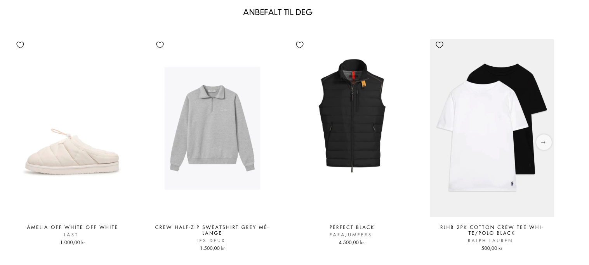

## Opgaven

Denne norske kunde skulle have redesignet sin gamle søgefunktion og sine gamle anbefalingsbokse på sin webshop. Der skulle indsættes anbefalingsbokse på forsiden og et par undersider. Det var spændende, da jeg ikke tidligere havde haft onboardsings, hvor netop dette var tilfældet.

## Process

### Anbefalingsbokse

Før jeg sendte opgaven til en fastansat udvikler, brugte jeg meget tid på at finde gode placement-selectors til anbefalingsboksene. Kunden havde 4 sider, hhv. Herre, Dame, Børn og Hus & Hjem, som hver især skulle have en anbefalingsboks, der viste top produkter i kategorien, og en anbefalingsboks, som viste anbefalede produkter til kunden. Først havde jeg tænkt, at jeg skulle lave 8 anbefalingsbokse, og så placere dem på hver side, men da det var umuligt at finde en unik placement-selector til hver side, blev alle anbefalingsboksene automatisk sat ind på alle sider. Det var mindre optimalt, så derfor endte jeg med kun at lave 2 bokse.

Én anbefalingsboks til top produkter, og én anbefalingsboks til anbefalede produkter. Disse blev sat ind med samme placement-selector på siderne, men kunne altid blive rykket rundt ved at kunden selv indsatte Hello Retails div'er. Så skulle anbefalingsboksene bare opsættes så de kun viste produkter, som var relevant ift. hvilken underside, som man befandt sig på.

Det kunne sættes op ved at crawle hjemmesidens url: `$("html").parent()[0].location.href.split("/").pop().replace("hus-hjem", "hjem").split().asHierarchy()` og derefter filtrere hvilke produkter, som anbefalingsboksen skulle vise: `hierarchies matches all of $hierarchies`.

Der skulle også ryddes op i en masse game anbefalingsbokse, som ikke længere var i brug på hjemmesiden. De gjorde selve implementeringen af de nye anbefalingsbokse til en mere uoverskuelig opgave, da listen af anbefalingsbokse på siden var dobbelt længde med duplikerede titler. Derfor valgte jeg at arkivere alle de anbefalingsbokse, som ikke længere var aktive på kundens hjemmeside.

Her er et billede af hvordan anbefalingsboksene endte med at se ud på på kundens webshop:



### Søgefunktion

Kunden ville gerne have opsat en Embeded Overlay Search til laptop, og en Grid Overlay Search til mobiltelefonen. Her opstod lidt problemer, da nogle af kundens produkter havde rigtig mange størrelser. Vi ville gerne vise tilgængelige størrelser på produktflisen, men vi blev nødt til kun at vise de første 10. Ellers ville produktflisen blive for uoverskuelig. 

Til at starte med, når man prøvede at lukke søgningen, var kundens egen oprindelige søgning stadig synlig. Dette var også et lille problem, som skulle løses. Ligeledes var der noget `border-radius` i bunden af nogle produktfliser, som også skulle ordnes.

Vi kiggede også på at implementere den funktionalitet, som automatisk fører kunden videre til en specifik produktvariant, hvis de trykker på den i produktflisen *(en tilgængelig størrelse)*. Dog fik vi ikke data i produktfeedet, som gjorde det muligt at koble en størrelse *(f.eks. `"XS"`)* til et produktvaiants id *(f.eks. `"09719543XXXX"`)*. Det betød, at vi desværre ikke var i stand til at implementere den funktionalitet.

Her er et billede af hvordan søgningen endte med at se ud på hhv. laptop og mobiltelefon:

	
	


## QA

### Self-QA

Inden at løsningen kunne gå videre til QA, fandt jeg selv lidt problemer under self-QA'en, som skulle løses. Et af disse var, at anbefalingsboksene var synlige på kategorisider, også selvom der var under 10 produkter i kategorien. Jeg skulle ind i anbefalingsboksen og crawle efter antallet af produkter i kategorien, så jeg kunne fjerne den, hvis der var for få produkter i kategorien. Det så således ud:

```js
extraData.isYouEnough: $(".collection-grid__wrapper .grid .grid-product:nth-child(10)").exists()
```

Med denne opsat kunne jeg tilføje et tjek i den logik, som fandt produkterne til anbefalingsboksen. Jeg kunne tjekke, hvis `extraData.isYouEnough === true`, og herefter ville logikken udvælge produkter. Hvis derimod `extraData.isYouEnough !== true`, ville der ikke blive fundet produkter til anbefalingsboksen, og dermed ville den ikke blive indsat på de kategorier, som havde under 10 produkter.

Jeg skulle også opsætte en url selector til anbefalede produkter i forhold til hvad kunden allerede havde i kurven. Det var for ikke at vise de samme produkter på kurve-anbefalingsboksen, som kunden allerede havde i sin kurv. Den kunne jeg sætte op således:

```js
urls: $(".cart__items .cart__item .cart__item-title .cart__item-name").fns("attr", "href")
```

