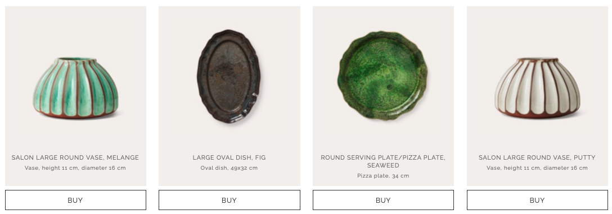
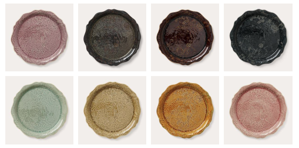
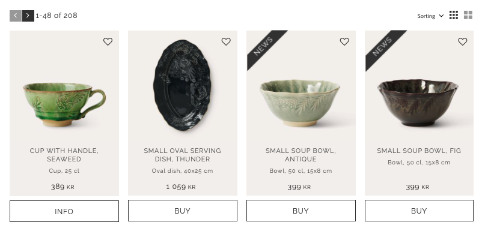

## Opgaven
For at lære de andre afdelinger bedre at kende, blev jeg sat til at shadow en fra Custommer Success i 90 minutter. Det var en meget sjov oplevelse, fordi jeg fik at se, hvad andre afdelinger i [Hello Retail](https://helloretail.com) fik tiden til at gå med.

Jeg skulle med en Custommer Success Manager gennemgå en "Competitor Alert" på en kundes webshop. Denne advarsel kommer, når  vi finder ud af, at konkurrerende virksomheder er interesserede i en af Hello Retails kunder. Der er altså ikke et aktuelt problem som kunden skal have løst, men siden skulle alligevel gennemgås for potentielle forbedringer, så et potentielt churn kunne stoppes *(når en kunde forlader virksomheden)*.

## Process

Vi ledte efter måder, hvorpå vi kunne forbedre den service vi allerede tilbyder, men også forbedringer med vores generelle viden om [søgemaskineoptimering](https://developers.google.com/search/docs/fundamentals/seo-starter-guide), [hjemmesidens ydeevne](https://developer.mozilla.org/en-US/docs/Web/Performance) og [brugeroplevelser](https://developer.mozilla.org/en-US/docs/Glossary/UX).

Vi snakkede blandt andet om, at den manglende pris på forsidens anbefalingsbokse kunne irritere potentielle kunder. Der var heller ikke meget fokus på køb-knapperne, så man kunne eventuelt prøve at ændre deres udseende, så de var mere tydelige:

Ydermere har kunden allerede en boks på produktsiden som viser alternative farver til produktet. Det gør vores egen anbefalingsboks lettere unødig, da den på nuværende tidspunkt er sat til at vise alternative produkter. I stedet kunne man ændre den til at vise produkter med samme farve, så man kunne blive overtalt til at købe et sæt af produkter med samme farve.

Der var også en anden tekst på produkter, som ikke var på lager. Der stod "info" i steder for "buy", og når man trykkede på knappen kom man inden på produktsiden, hvor der så stod watch. Her snakkede Custommer Success Manageren om at ændre knappen til en "pre buy" knap, så kunden stadig kunne købe varen, men med længere leveringstid.

Vi snakkede også kort om, at der nok burde blive vist engelske priser, når hjemmesidens sprog blev sat til engelsk. Alt dette og meget mere blev skrevet ned og gennemgået i et møde mellem Custommer Success Manageren og kunden.

## Afrunding

Det var meget lærerigt at arbejde sammen med en Custommer Success manager fra en anden afdeling. Det var spændende at se, hvordan de går struktureret igennem en hjemmeside og analysere hvordan den kan forbedres. De trækker meget på deres viden om brugeradfærd for at danne sig et overblik over hjemmesiden.

Selvom det ikke er super tekniske, har de stadig brug for en dyb teknisk viden, for at forstå og sætte sig ind i potentielle problemer. bl.a. havde hjemmesiden en masse søgemaskineoptimeringstekst på deres kategorisider, men det var korrekt placeret i bunden, så produkterne var let tilgængelige for potentielle kunder.