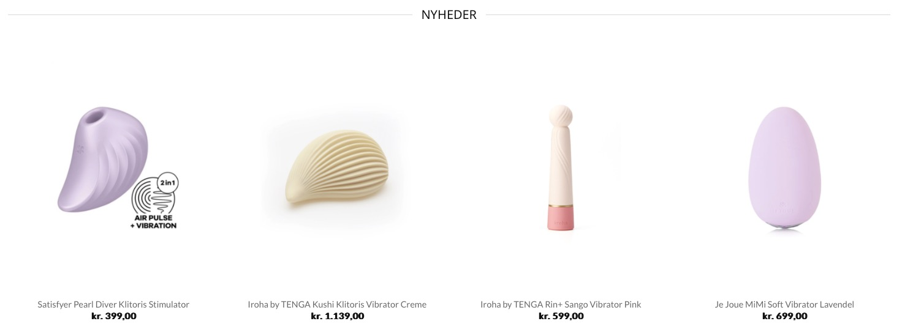
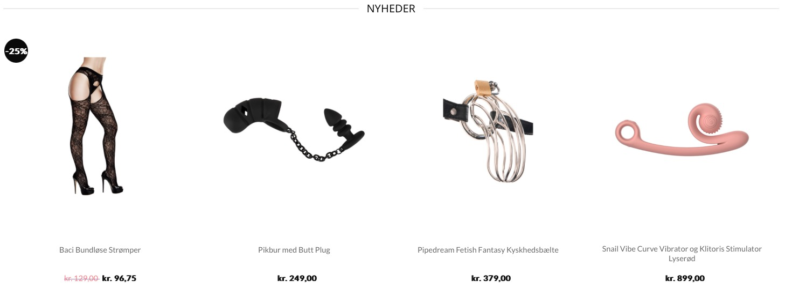
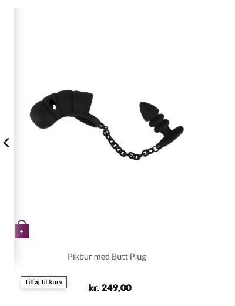
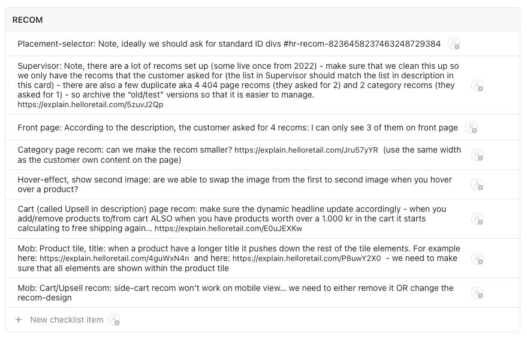

## Opgaven
Mit første større arbejde på praktikpladsen var med en dansk virksomhed, der solgte produkter til voksne, og havde købt [Hello Retails](https://helloretail.com) [anbefalingsbokse](/introduktion-til-anbefalingsbokse). De havde tidligere anbefalingsbokse, men et redesign var nødvendigt. 

Kunden ville gerne havde anbefalingsbokse på deres kuveside, deres forside, deres produktsider, deres 404 side og deres kategorisider. Ydermere skulle der være en dynamisk titel på kurvesiden, som fortalte kunden hvor tæt de var på at opnå gratis forsendelse *(ordrer over DKK 399)*. Dette skulle jeg stå for at implementere.

## Process

Heldigvis var selve produktflisen allerede implementeret i søgefunktionen på siden, så den kunne rimelig smertefrit genbruges i anbefalingsboksene. Derimod var opsætningen af [swiper](https://swiperjs.com/) mere udfordrende, da vores standarddesign langt fra lignede deres eget design. Her er hvordan deres eget design ser ud:

Og her er hvordan mine anbefalingsbokse ser ud *(med andre produkter)*:

Under udviklingen af anbefalingsboksene løb jeg ind i flere små finurligheder. Blandt andet havde kundens egne anbefalingsbokse et andet billede, når man havde sin cursor over en produktflise. Dette kunne jeg ikke implementere, da kundens [produktfeed](/introduktion-til-produktfeed) kun gav os et enkelt billede. Ydermere var der lidt problemer med pileknapperne til anbefalingsboksene, som skulle have en indsat skygge, når brugeren havde sin cursoren inden i anbefalingsboksen *(for at vise at der kan scrolles)*. Denne skygge gad ikke være det rigtige sted, og den dækkede også for “tilføj til kurv”-knappen på produktflisen.

Jeg sad og arbejdede med dette alene, men fik heldigvis massere af hjælp fra de andre fastansatte udviklere. Slutproduktet endte med at blive rigtig godt, og både skyggen og knappen var fikset, da jeg d. 19/1/24 sendte den digitale løsning til QA *(en produktflise ses her med cursoren over produktflisen, så både den indsatte skygge og “tilføj til kurv”-knappen vises)*.

## Quality Assurance

Efter løsningen havde været igennem QA *(Quality Assurance)*, fik jeg en liste med punkter som jeg skulle gennemgå. Denne liste indeholdte både punkter der havde været tænkt over, men heldigvis også nye observationer om løsningen og eventuelle forbedringer:

Her valgte jeg først at kontakte de fastansatte udviklere for at få hjælp til nr. 4, 6, 7 & 8. Der var ikke noget, som jeg kunne gøre ved nr. 5, og kunden havde ikke fortalt hvor på forsiden den sidste anbefalingsboks skulle placeres *(ift. nr. 3)*. 

For at få løst nr. 1 og 3 kunne jeg *(efter min [introduktion til kundekontakt](/introduktion-til-kundekontakt))* tage kontakt til kunden gennem mail og få dem løst. Her er et udsnit af den sendte mail til kunden:

>Hej [...]!
>
>Mit navn er Frej, og jeg arbejder på dine anbefalingsbokse [...] som implementationsspecialist.
>
>Den mest optimale måde at indsætte anbefalingsboksene på [...] er, hvis I placerer Hello Retail div-tags på hjemmesiden. Læs mere om hvordan det han gøres her *(engelsk)*. Du kan finde listen over dine personlige div-tags som vedhæftet fil i denne mail.
>
>Ydermere skal jeg have opklaret, hvor på forsiden jeg skal placerer anbefalingsboksen med varer på udsalg. Denne anbefalingsboks er nemlig ikkeeksisterende på den nuværende side. 
>
>Ved eventuelle spørgsmål skriv endelig!

## Afrunding

At arbejde med denne kunde har været en meget lærering og spænende oplevelse. Arbejdet med redesigns og indsætning af nye anbefalingsbokse til kundens webshop har lært mig, hvor anderledes det er, at arbejde på en løsning som en betalende kunde skal modtage. Selvom at selve anbefalingsboksen er et relativt lille komponent på deres hjemmeside, kan det hurtigt blive meget uoverskueligt at arbejde med, hvis man ikke er vant til det. Der er meget forskellig kode, og mange forskellige små workarounds til problemer, som man støder på.

Man bliver nødt til at tage det roligt og arbejde mere struktureret end hvis det var ens eget projekt *(hvor man kender sin egen kode ud og ind)*. Hvis man ikke kan slå koldt vand i blodet ender det med at stikke helt af. 