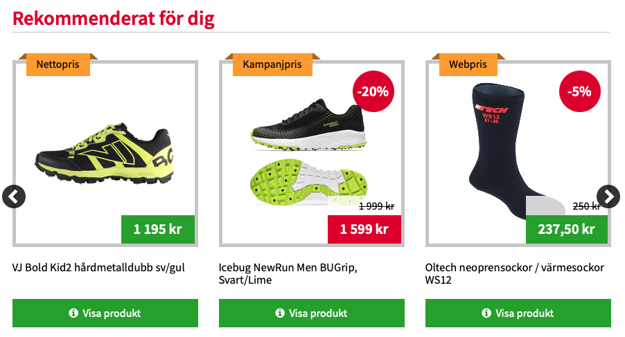

## Opgaven

Jeg skulle oprette produktfliser til denne kundes nyhedsbrev og e-mail. Produktfliserne skulle ligne de fliser, som allerede var implementerede i kundens anbefalingsbokse:

## Process

Jeg startede med at prøve at genbruge så meget struktur og styling, fra kundens eksisterende anbefalingsbokse som muligt. Dog løb jeg ind i et par problemer, da der var meget af stylingen, som ikke gad samarbejde.

- **Problemer med produktbillede**

  Jeg prøvede at få produktbillederne i produktflisen til at se godt ud på flere forskellige måder. Hverken en `max-width` med en `height`, en `max-height` med en `width` eller en `object-fit: cover;` kunne klare opgaven. 

- **Problemer med centrering af udsalgsprocent**

  Udsalgsprocenten blev vist i en rød label på produktflisen. I dette label skulle teksten være centreret horisontalt og vertikalt, men hverken `display: grid` med `place-items: center`, `display: flex` med `align-items: center; justify-content: center`  eller en ` position: absolute; top: 50%; left: 50% ` med `transform: translate(-50%, -50%)` fik teksten i midten af labelet.

- **Problemer med semitransparent førprisbaggrund**

  Eftersom førprisen på udsalgsprodukter godt kunne skjule noget af produktbillede, var baggrunden blevet sat til en gennemsigtig hvid farve på anbefalingsboksene. For at opnå samme effekt på produktfliserne i nyhedsbrevet produktfliser prøvede jeg både at sætte en `background-color: rgba(255, 255, 255, 0.5)` og `background-color: #ffffff80`, men til ingen nytte.

- **Problemer med Font Awesome Ikon**

  Anbefalingsboksene havde et ikon fra [Font Awesomes](https://fontawesome.com) ikonbibiolotek. Da ikonet ikke er et billede, men i stedet en typeface, kan vi ikke bare overføre det direkte til nyhedsbrevets produktfliser.

Efter at have prøvet diverse løsninger endte jeg med at skrive en mail til en af de fastansatte udviklere. Jeg fik denne mail tilbage:

>[...]
>
>In general you were doing everything right, but in newsletters a lot of "modern" CSS doesn't work, so you can use stuff like rgba, flexbox or grids, transforms and so on. It supports some of the CSS3 properties, but just basic ones, like e.g. border-radius. It also renders fonts slightly different and we have a certain amounts of fonts that we can use in the newsletter editor.
>
>Since newsletter is an image with fixed dimensions and the content of it is not responsive, you can use absolute positioning for elements w/o fear that it will break the layout, since elements within the tile will have fixed placement/size pretty much all the time. Of course you need to make sure that you've positioned everything correctly in the first place.
>
>[...]
>
>Icon fonts are not supported in newsletters. You can try to get a png image for it, if the icon is really necessary.
>
>[...]

## Resultat

Den færdige produktflise endte med at være meget lig deres anbefalingsbokses produktfliser. Selvfølelig uden eventuelle hovereffekter, da produktflisen bliver sat ind som et billede i deres nyhedsbrev. Her er en sammenligning af deres produktflise i deres anbefalingsboks *(første)*, og den færdige produktflise til deres nyhedsbrev *(sidste)*:


	
	


## Afrunding

Arbejdet med produktfliser til Kundens nyhedsbrev har været noget af en øjenåbnende oplevelse. Det var en udfordring at arbejde med, fordi nogle af de helt basale CSS egenskaber som bl.a. flexbox og værdier som `rgba(x,x,x,x)` ikke var *(eller kun delvist var)* tilgængelige.

Selv med disse restriktioner kunne produktflisen dog stadig designes. Jeg måtte side og udforske lidt, hvilke styles som teknologien godtog, men jeg kunne godt arbejde med det. Det er lidt som hvis man skal understøtte ældre browsere, hvor man må lave workarounds for de nyeste og mest moderne CSS egenskaber.