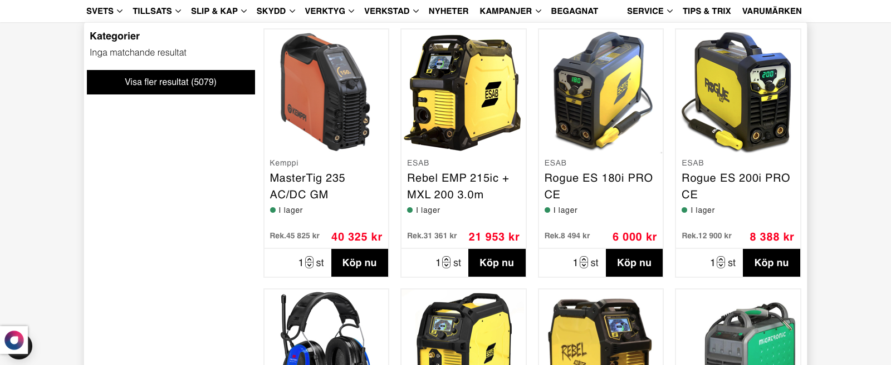

## Opgaven

Denne svenske kunde havde allerede vores anbefalingsbokse, men ville også gerne have implementeret vores søgefunktion. De ville gerne have Instant Grid Search som deres [søgningstype](/introduktion-til-søgefunktion#søgefunktionstyper) på laptop, og Overlay Search på mobiltelefon. Selve produktfliserne i søgningen skulle være identiske til de fliser, der allerede var i deres anbefalingsbokse.

Kunden ville gerne have sat sin Instant Search Grid og Instant Seach Grid Page op, ligesom vi havde gjort for en tidligere kunde. Dog skulle kategorierne være på venstre side i stedet for højre. Ligeledes ville de gerne have, at deres Overlay Search skulle være den samme som hos vores kunde en anden tidligere kunde. Du kan se hvordan de forskellige søgninger ser ud her:


	
	


## Process

For at opsætte kategorier i kundens søgningsfunktion, var det nødvendigt at kunden stillede et indholdsfeed *(content feed)* til rådighed. Dette var der ikke til at starte med, så jeg skrev til kundes Custommer Success Manager for at høre, om det var noget kunden allerede havde ordnet. Her fik jeg at vide, at jeg skulle begynde udviklingen af søgefunktionen uden, men gøre plads til, at kategorierne eventuelt kunne blive tilføjet.

For hurtigt at komme i gang med implementeringen blev opgaven først sendt til en af de andre fastansatte udviklere. Her kunne søgefunktionen hurtigt blive sat op, hvilket ville gøre det nemmere for mig at finpudse og færdigudvikle. Dette var, hvad jeg fik tilbage:


	
	


### Problemer med styling

Udfra dette kunne jeg gå i gang med at fikse diverse problemer. Først var der helt generelle problemer som underlige hover-effekter på produktfliserne, forsvindende knaptekst når man holder sin cursor over knappen, og kundens egen søgning, som stadig var synlig under vores. Du kan se disse problemer her:


	
	
	


De fleste af problemerne kunne løses ved, at jeg tilføjede/ændrede i vores søgningsfunktions stylesheet. Du kan se nogle af disse ændringer i dette kodeudsnit:

```css
/*Udkommenter uønsket box-shadow fra produktflisen ved hover*/
.aw-grid-search-results__item:hover {
	/*box-shadow: rgba(0, 0, 0, .2) 0 1px 6px 0;*/
	[...]
}

/*Gør knapteksten synlig når cursoren holdes over knappen*/
.aw-grid-search-results__submit-link:hover{
	color: white;
}

/*Fjern kundens egen søgefunktion og overlay*/
.search form span[data-doofinder-autocomplete-holder]{
	display: none
}
main div[data-overlay].overlay {
	display: none !important; /*!important for at overskrive kundens inline-styling*/
}
```

### E-mailkorrespondance

Der var også yderlige problemer, men før jeg kunne begynde at løse disse, var det vigtigt jeg kontaktede kundens Custommer Success Manager. Produktfliserne gjorde nemlig, at der var en vertikal "scroll" i den implementerede søgningsfunktion. For at undgå eventuelt spildt arbejdstid, skulle jeg have opklaret, om dette var den ønskede opførsel. Her er den engelske mail, som jeg skrev til kunden:

>Hi [...],
>
> I'm Frej, the implementation specialist on your new Professional Search Solution.
>
> Due to the nature of the implemented product tiles, the instant Instant Grid Search Solution will have some vertical scrolling to reach the last row of products. I need to be sure that this conforms with your expectations. This picture shows the aforementioned situation:
>
>
>
>Will this be an acceptable approach to implementing your Professional Search Solution, or would you rather prefer we simplify the product tiles to minimize the vertical scrolling?

Der var også problemer med, at Instant Search kunne sige, at der f.eks. blev fundet 9 produkter, men hvis man navigerede til søgningens Instant Search Page, var der et andet antal produkter, eller nogle gange helt andre produkter. Ydermere lukkede søgningen ned, hvis man trykkede mellem produktfliserne, prøvede at øge mængden af produkter, som skulle tilføjes til kurven eller hvis man highlightede tekst fra produktflisen. På tablet var der også nogle af de længere priser, som overlappede den anbefalede produktpris.

Da kunden vendte tilbage, var det med svar om, at den vertikale scroll ikke var et problem, men at vi kunne minimere det ved at fjerne købsknapperne fra søgningen.

Jeg sendte opgaven til en af de fastansatte udviklere, som hurtigt kunne løse de fleste af problemerne. Herefter gik jeg i gang med at [self-qa](/introduktion-til-quality-assurance/)'e løsningen.

## QA

### Self-QA

I løbet af selv-QA'en fandt jeg et problem med nogle produktfliser i Overlay Search søgefunktionen. Nogle produkter, som havde varianter *(f.eks. handsker med forskellige størrelser)*, kunne ikke blev tilføjet til kurven, når man trykkede på produktflisens køb-knap. Dette kunne fikses ved at sætte en crawl op på produktsiden, som tjekkede produktet for varianter:

```js
extraData.hasVariants: $("form[name='add_product'] .product-variants").exists()
```

Efter at have opsat denne nye variabel og recrawlet produktsiderne, kunne man tjekke for den nye variabel i søgningens produktfliser:

```html
<div class="buttons" style="width: 100%;">
	
		<a
			href="{{ product.url}}"
			style="width: 100%;">
			Läs mer</a>
	
		<button
			type="submit">
			Köp nu</button>
	
</div>
```

Det var også nødvendigt at indsætte noget styling, eftersom knappen ellers ikke ville fylde hele produktflisen, men i stedt ville give plads til, at brugeren kunne ændre antallet af produkter, som skulle tilføjes til kurven. Her kan du se, hvordan produktflisen så ud inden den ekstra styling *(første)*, og efter den havde fået den rigtige styling *(sidste)*:


	
	


### QA Feedback

Der var ikke meget som QA kunne sætte en finger på. Primært handlede det om det manglende orderfeed, det manglende kategorifeed og en manglende side, som vi kunne bruge som søgeside. Alt dette skulle kundens egen platform dog selv stå for. Det eneste, som jeg selv kunne forbedre på løsningen, var dette:

* Can we add a space between ‘Rek.’ and price?

	Her skulle jeg ind i de 3 aktive søgningstyper; Instant Search, Fullpage Search & Overlay Mobile Search og ændre i liqid-koden. Det samme gjaldt for de 3 designs til anbefalingsbokse, som var i brug på siden:

	```html
	
		<span class="price-recommended">
			Rek. {{ product.oldPrice }}
		</span>
	
	```
For at kunne få fikset problemet med kundens platform var jeg i kontakt med kundens Customer Success Manager, som allerede var i kontakt med platformen. De udleverede den manglende side, som vi skulle bruge

## Afrunding

De fleste udfordringer ved denne kundeopgave opstod i/under kommunikationen med kundes platform. Der var mange ting, som var besværlige at få fra dem *(bl.a. feeds og sider)*, og deres support var langsom og uforstående. Det gjorde selve onbordingen til en længere process.

Det var interessant at prøve at arbejdet på et projekt, som ikke kan komme videre på grund af eksterne forhold. Normalt på studiet er det kun ens egen indsats, der sætter grænser for arbejdet, men på en arbejdsplads med mange kunder og ekstern samarbejdskilder, kan der opstå lange perioder med uønsket ventetid.