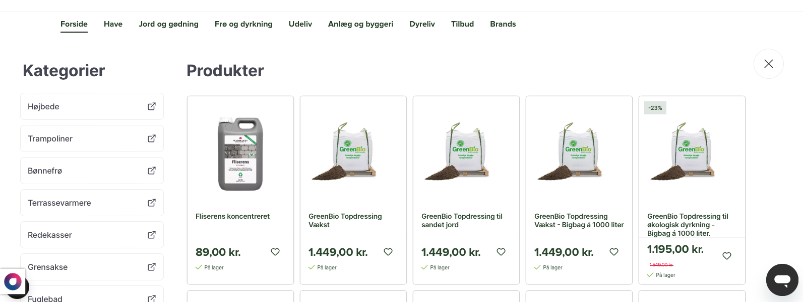

## Opgaven

Denne kunde ville gerne have implementeret vores søgefunktion og vores anbefalingsbokse på deres nye hjemmeside, som skulle erstatte deres nuværende hjemmeside. Her skulle jeg, for første gang nogensinde, arbejde på en testhjemmeside, hvilket krævede et brugernavn og en adgangskode.

## Process

Først loggede jeg ind på kundens testhjemmeside, og lagde med det samme mærke til flere forskellige ting:

- Jeg kunne ikke genbruge nogle produktfliser, da de nye produktfliser var meget ulig de gamle fliser fra den side, som allerede var oppe og køre.

- Siden havde flere forskellige slags produktfliser, hvilket vi ikke kan arbejde med i vores søgningsfunktioner og anbefalingsbokse.

- Siden havde ikke installeret vores Hello Retail script. Hvilket gør det umuligt at opstarte arbejdet på deres søgning og anbefalingsbokse.

For at få svar på disse problemer skrev jeg en e-mail til kunden. Jeg fik et hurtigt svar om, at deres udvikler var i gang med opsætningen af vores script. Ydermere gav han et link til en designfil, hvor de færdige produktfliser kunne ses. Kunden kunne, efter scriptet var sat op, så sende mig et link til hhv. produkt-, ordrer- og kategorifeedet til hjemmesiden, se det også kunne komme op og køre.

### Opsætning af feeds

#### Produktfeedet

Produktfeedet skulle sættes op i Hello Retails nye system *Company Land*. Det var meget lige til, jeg indsatte produktfeedets webadresse, som jeg havde fået fra kunden, og angav `root > products > product` som produktvejen i XML dataen. 

Der var umiddelbart ikke store problemer med produktfeedet, selvom vi manglede noget data. Der var produkter, hvor `oldPrice` værdien var `""`. Dette løste jeg ved at indsætte den nuværende `price`, hvis `oldPrice`-værdien var en tom `string`:

```js
function transform(product:any): TransformationResult {
	return {
		...product,
		oldPrice: product.oldPrice !== "" ? product.oldPrice : product.price
	};
}
```

Der var også 2 labels, som kunden havde opsat; "Nyhed" og "Bestseller". Disse kunne vi ikke finde i produktfeedet, så jeg blev nødt til at tage kontakt til kunden.

#### Kategori- & Ordrerfeedet

Både kategorifeedet og ordrerfeedet skulle sættes op i det gamle *Supervisor*-system. Her skulle jeg, ligesom med produktfeedet, indsætte webadressen til feedet, vælge hhv. `orders > order` og `categories > category` som vejen til ordrer og kategorier i XML dataen.

Eftersom kundens nye side også var sat op med en anden platform, skulle jeg selv opsætte crawlingen af data fra de to feeds. Der var ingen standardopsætning til deres nye platform. Her kan du se, hvordan jeg har sat de to feeds op:

- **Kategorifeed**

    ```js
    title: $("title").text()
    url: $("url").text()
    description: $("description").text()
    keywords: $("keywords").text()
    hierarchy: $("hierarchy > category")
    ```

- **Ordrerfeed**

    ```js
    orderNumber: $("orderNumber").text()
    total: $("total").text()
    (datefmt:"yyyy-MM-dd HH:mm:ss")date: $("createdDate").text()
    email: $("email").text()
    productNumbers: $("orderProducts > product > productNumber")
    ```

### Opsætning af søgefunktion

Efter at have været hos den fastansatte udvikler var søgefunktionen implementeret. Dog var den blevet opsat på engelsk, så jeg skulle ind og ændre i hele koden for at få søgningen oversat til dansk.

Der var også andre mindre problemer, som f.eks. at produkter på udsalg ikke havde et "SALE"-label på, og det manglede et ikon for, om produktet var tilgængeligt eller ej. Disse problemer var dog relativ nemme at løse.

Søgningen endte med at se således ud:


### Opsætning af anbefalingsbokse

Der var ikke draftet nogle anbefalingsbokse fra starten af onboardingen. Det betød, at jeg skulle kontakte kundens Custommer Success Manager for at finde ud af, hvilke andbefalingsbokse kunden skulle have, og hvor de skulle være placeret hende på webshoppen.

